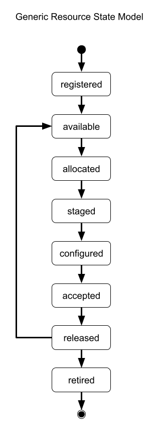
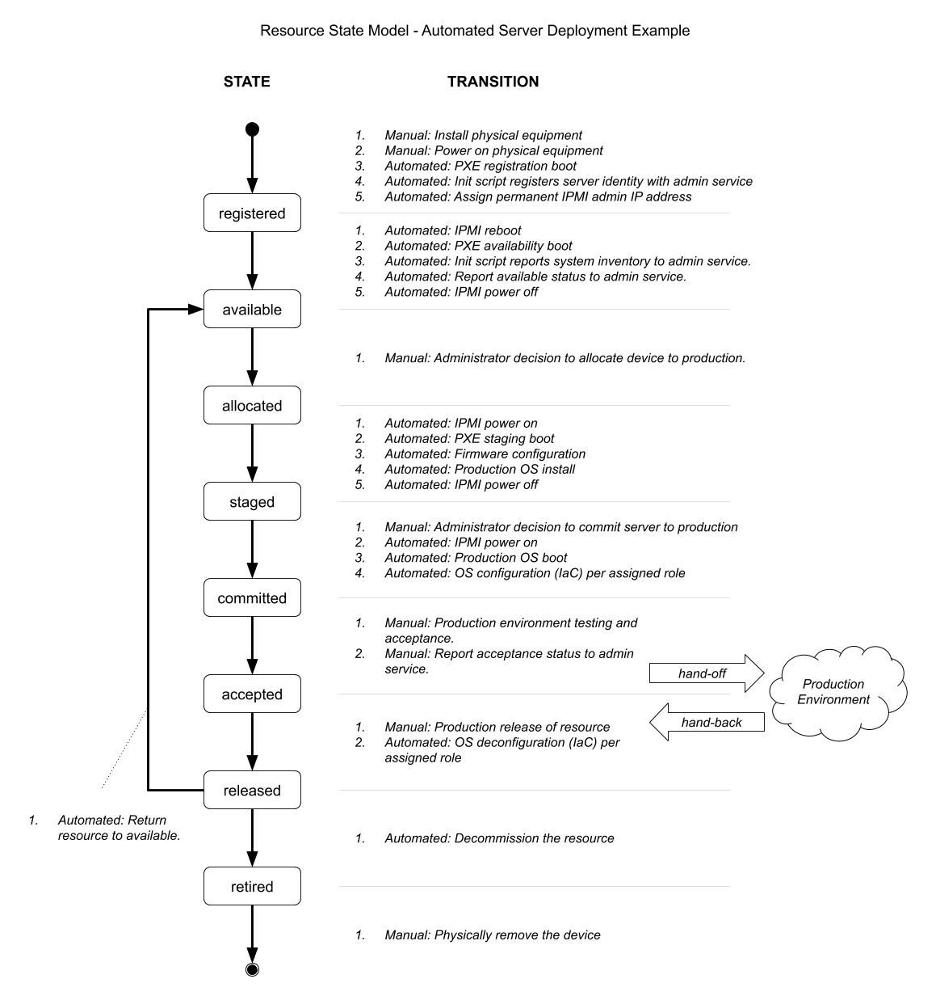
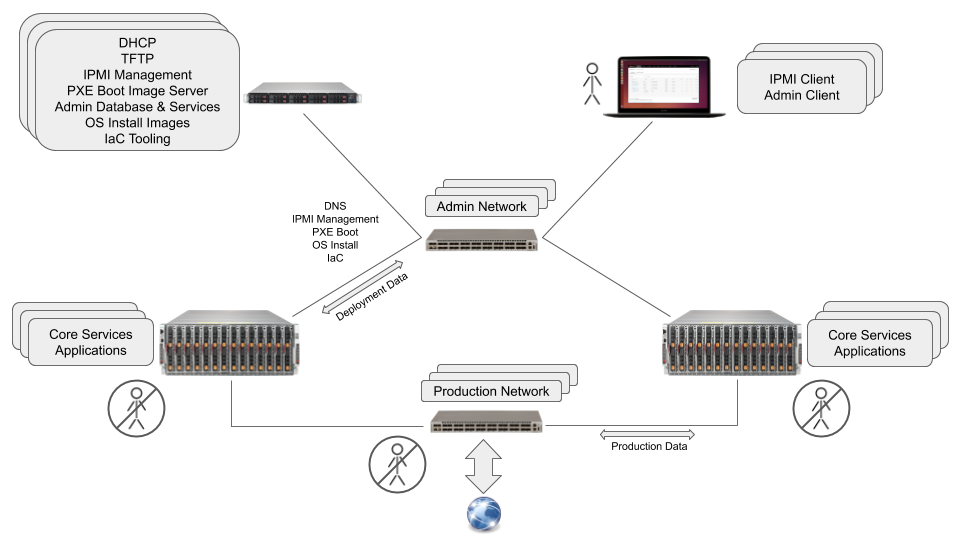
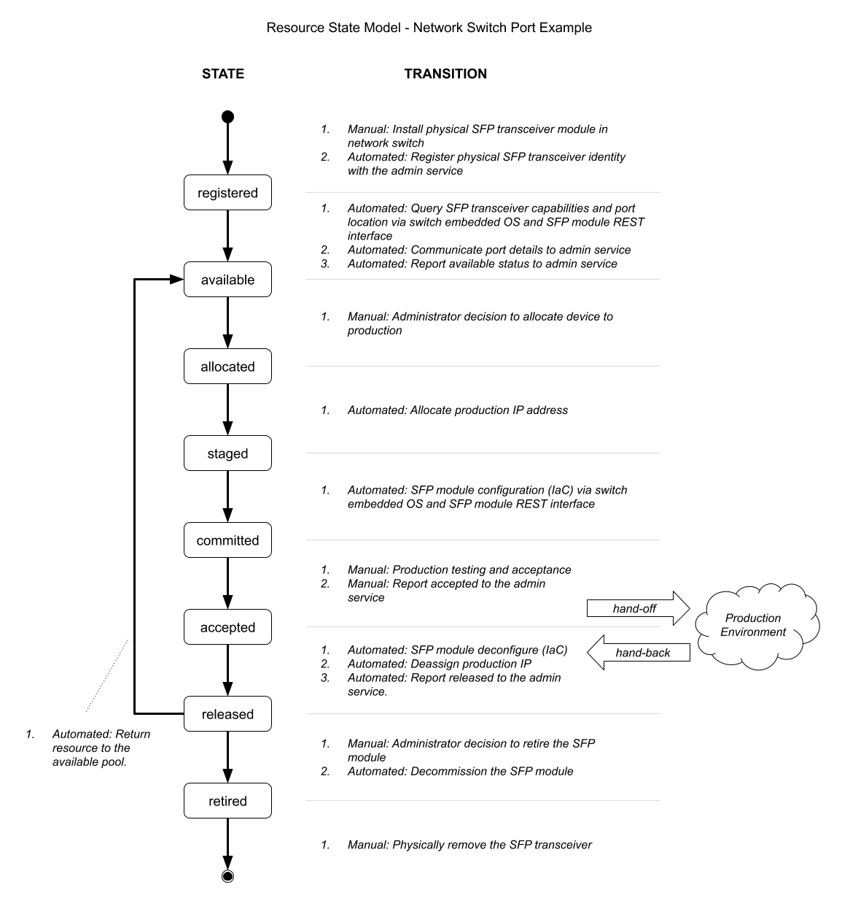
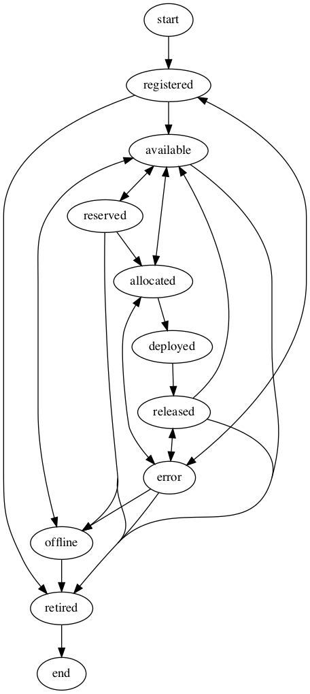

# Deployment, Provisioning and Resource Management: Overview

## Introduction

  TO BE COMPLETED (last writing step)

  * Put a definition on the term "deployment"
  * Encompass: identification, allocation, configuration committment for production, and eventual retirement of resource.
  * Summarise use cases: servers, network switches, video switches, video production equipment, etc.
  * Identify significance and influence of MaaS.
  * Identify significance of IaC integration.
    
## Resource Management Lifecycle

Resource management is represented using a simple life-cycle state model. A "resource" generically represents equipment that is managed by a process of identification, allocation, configuration, and committment of the resource. Managing the deployment and configuration of a resource is the process of reliably moving the resource through this set of states.

 *Resource management lifecycle conceptual state model.*

| State | Description |
|---|---|
|registered | Resource existance and identity is recorded. |
|available | Resource is available for allocation to production. |
|allocated| Resource is allocated to production. |
|staged| Resource staging phase of initialization is complete. |
|committed| Resource configuration phase of initialize is complete and it is committed to production. |
|accepted| Resources was accepted and is active in production. |
|released| Resource is no longer active in production. |
|retired | Resource is ready to be removed from the facility. |

<!--
|staged| Resource is initialized and ready for configuration.| Firware configured, OS installed, initial network configuration. |
|configured| Resource is configured and in production, e.g. media device role assigned, name assigned, active media interfaces, ready to be tested. |
-->

## Resource Management as a State Machine

Deployment and configuration can be thought of as  finite state machine where deployment tasks are completed by the transitions that move a resource from one state to the next. A "state" represents the condition of a resource at a point in time. A "transition" represents the actions that are performed to move the resource from one state to another state. A resource only moves from one state to another by succsesful execution of transition.

In this sense, resource "state" can be thought of as an attribute of a resource that stored in a resource administration system, i.e. a database. When an administrator uses the admin system to check the state of a resource they are viewing the single source of true of that resource's state. If the resource changes state it because the admin system executed a transition that performed the work necessary to move it to the new state (and that that transition completed without error). Maintaining the admin system as the source of truth means that the admin system has sole responsibility for persisting the resource state and it has sole responsibility for initiating transitions that change state. The admin system's view of "state" is very concrete: it's a field in a database that represents a state in a state machine. The admin system's view of "transition", however, is very abstract. It has no idea how a transition is implemented, just that it is implemented and that is can be initiated upon request. Transition "implementations" are the point where the conceptual state model is adapted to real world resources.

The following diagram identifies typical tasks that are completed during transitions in order to move a resource through its deployment and configuration lifecycle. It doesn't matter if a transition is automated, or manual, or a combinination. What matters is:

* The admin system initiates the transition.
* The transition leaves the resource in a condition that is conceptually consistent with the lifecycle model.
* The admin system receives unequivocal notification of transition success or failure.

 *Generic resource management lifecycle with described state transitions.*

## Automated Resource Management

There is no requirement that transitions are automated in order to implement a resource manager. All transitions could be work orders completed manually by technicians. If transitions are automated, howerver, then resource lifecycle management can be automated. The limits of automation is the physical installation of new equipment, physical removal of retired equipment, and the highest level management input necessary to direct an admin system that acts as the human interface to the resource management system.

### Automating configuration of server resources

Automated deployment and configuration of servers is possible by combining mature network system management services, network boot services, metal-as-a-service (MaaS) methodologies for intial system bring up, and infrastructure-as-code (IaC) methadologies for final configuration.

Specifically:

* Use IPMI for network access to system management controllers
* Use PXE for network boot, which employs standard DHCP and TFTP network services
* Prefer automated operating system installation, as supported by individual OS vendors.
* Prefer IaC methods supported by leading implementations such as [Puppet](https://puppet.com/) and [Ansible](https://www.ansible.com/).

The role of this document is to identify where these technologies are used to implement automated server deployment and configuration in the context of the resource lifecycle managment model. They are not discussed indivudally in depth.

Note that IPMI is a deprecated standard and that new system management standards such as [Redfish](https://redfish.dmtf.org/) fullfil an equivalent purpose.

### Automating configuration network resources

Networking equipment can be treated as a resource in the resource model, both at the level of a switch and hierarchically at the level of individual network ports. As such, it's possible to dynamically deploy and configure network resources if configuration interfaces and API's exist. For example, Arista network swtiches provide [EOS](https://www.arista.com/en/products/eos), an embedded Linux operating system , that can be used automate switch configuration. The presence of an embedded Linux operating system provides the opportunity for rich implementation of IaC methadologies directly on the network switch. At the individual port level, Embrionix provides a [REST api](https://www.embrionix.com/resource/emSFP-Restful-API-documentations) to configure individual SFP modules.

These two implementations can be viewed as emerging best practice for network resources:

* Prefer REST API's for device configuration.
* Prefer SSH access to a command line interface.
* Prefer an accessible embedded operating system to enable implementation of rich IaC methadologies.

## Resource Deployment State Model - Metal-as-a-Service Example

Metal-as-a-Service (MaaS) refers to the automated povisioning of "bare-metal" compute resources in a data ceter. The term "bare-metal" is a reference to the "bare" configuration state of servers when they are first installed in the data ceter. "Service" refers to the automated management of deployment and configuration of these server resources. This is often described as "cloud style provisioning" because it is representative of the methadologies used by large internet service providers who provide "cloud" computing resources.

MaaS encompases automation of the following:

* server hardware identification
* firmware configuration
* allocation of server resources
* operating system installation
* application sofware installation and configuration
* network configuration
* decommisionning

Metal-as-a-service (MaaS) implementation patterns leverage very mature industry standards to automate system mangement and monitoring, network boot, IP address management. MaaS system leverage these standards by adding automation tooling and administration systems that support managing many system reliably and efficiently at production scale.

| Standards | |
|---|---|
|DHCP| Dynamic Host Configuration Protocol | IP address assignment, and provider of PXE boot configuration. |
|TFTP| Trivial File Transfer Protocol | File transfer protocol used to load the network boot executable image. |
|PXE| Preboot Execution Environment | Network boot capability built on DHCP and TFTP. Built into system firmware. |
|IPMI| Intelligent Platform Management Interface | Out-of-band system management and monitoring independent of the host CPU and OS. Independent network interface, controller, and firmware. |

### Example Existing Industry Solutions:

* [Ubuntu MaaS](https://maas.io/) is an example of an existing commercial implementation.
* [GitHub metal cloud](https://github.blog/2015-12-01-githubs-metal-cloud/) is an example of proprietary implementation.

### Metal-as-a-Service representend using the resource model

The following diagrams maps typical MaaS server configuration operations onto the resource model. The operations described in each transation can be entirely automated with the exception of administrator input to allocate, and retire, server resources.

*Resource deployment metal-as-a-service example.*

### Separate Admin and Production Networks

MaaS systems use a server's system manage controller to configure, monitor, and control the server via IPMI. These interfaces are typcally confiugred on a dedicated amdministrator network that is separate from production networks. In addition, network interfaces are configured for admin network PXE boot, automated OS install, and IaC configuration. Configuring a server's production network interfaces is the responsiblity of IaC processing. An individual server's network configuration happens in conjuction with configuration of dependant network services (switches, ports, etc). A fully automated deploy system requires no manual human configuration of production servers, or production network services. In a media environment this automated configuration may included video switch configuration.

*Independent admin and production network.*

## Resource Deployment State Model - Network Swith Port Example

Incorrporation of network configuration in IaC deployment methodologies is becoming possible. See, for example, [CBC's implementation of IaC configuration of Embrionix emsfp EB22 modules using Ansilbe playbooks](https://github.com/cbcrc/ansible-embrionix). The opens the possiblity of treating network switches, and individual network ports, as resources that can be managed as part of production deployment and provisioning system. A resource model instantiation that might implement this is shown below.

*Resource deployment network switch port example.*

## Security

### Adhere to AMWA BCP-003

 * OAuth2 secury user authorization
 * TLS 1.2 for secure socket communication
 * X.509 certificate installation support
 * HTTPS exclusively for REST API's
 * REST API's use Authorization headers and Json Web Tokens

These recomendations conform to [AMWA BCP-003](https://amwa-tv.github.io/nmos-api-security/) "Security recommendations for NMOS APIs". BCP-003. AMWA BCP-003 describes best practies for implementing secure web intefaces using HTTPS and OAuth2 user authentication.

### Additional recommendations beyond AMWA BCP-003

 * SSH access secured by OAuth2 user authorization
 * SSH access secured by SSH-authorized keys
 * X.509 certificate support for SSH-key authorization
 
IaC tooling normal requires SSH access to the systems under configuration. SSH user authorization should use OAuth2. SSH authorized keys are preferred, and normally necessary, for automated SSH login. Systems that support SSH login should provide methods for installing public keys to enable SSH authorization. Note that some, but not all, SSH implementations support X.509 certificates. This provides system administors the opportunity for uniform key management and sharing of keys used for HTTPS configuration.
    
__*TODO - Traditional SSH authorized_key sharing has security problems. Study SSH certificates including X.509 support.*__

__*TODO - Consider update of BCP-0003 to include service account recommendations.*__

### Service Accounts

 * Use of service accounts for server-to-server interaction

Automated server to server interactions in trusted environments that are not perforrmed on behalf of an end user should use service accounts. A service account is an account that belongs to an application instead of an individual end user. 

Service account authorization is supported using OAuth2 "two legged" authentication. See: [OAuth 2.0 Client Credentials Grant](https://oauth.net/2/grant-types/client-credentials/)

## Appendix - Resource State Model: Example fuller representation

A real-world implementation of a resource life-cycle model is necessarily more complex than the conceptual model presented here. Additional complexities may include:

* Additional states are required to implement requirements suchs as reservation of resources, or putting resources offline for maintenance.
* The requirement for a fuller set of transitions between states that is represented by a simple conception model.
  * e.g. to return to "available" from "allocated" without ever having been deployed.
  * e.g. retiring a registered resource before ever having made it available
* The real-world requirement for robust exception handling that introduces error states.

The finite-state-machine model below represent these additional complexities.

 
*Example fuller representation of resource state model finite state machine. Blue transitions represent the simpler conceptual model.*

| Current State | Transition | Next State |
|---|---|---|
|start| T_new_register |registered|
|registered| T_make_new_available |available|
|registered| T_retire |retired|
|registered| T_from_reg_error |error|
|available| T_allocate |allocated|
|available| T_retire |retired|
|available| T_put_offline |offline|
|available| T_reserve |reserved|
|reserved| T_make_existing_available |available|
|reserved| T_allocate |allocated|
|reserved| T_retire |retired|
|reserved| T_put_offline |offline|
|offline| T_make_existing_available |available|
|offline| T_retire |retired|
|allocated| T_stage |staged|
|allocated| T_make_existing_available |available|
|allocated| T_from_alloc_error |error|
|staged| T_commit | commit |
|commited| T_accept |accepted|
|accepted| T_release |released|
|released| T_make_existing_available |available|
|released| T_retire |retired|
|released| T_from_release_error |error|
|error| T_error_recover | registered |
|error| T_error_recover | allocated |
|error| T_error_recover | released |
|error| T_error_recover | offline |
|error| T_retire | retired |
|retired| T_end_of_life |end|

*Example state transition table.*
  

| Transition | Activity or Processing |
|---|---|
|T_new_register | Register the identity of a new resource. |
|T_make_new_available | Perform processing to make a new resource available. |
|T_make_existing_available | Perorm processing to return an existing resource to available. |
|T_allocate | Allocate a resource for production deployment. |
|T_stage | Perform first phase of initialization to prepare a resource. |
|T_commit | Perform second phase of inititialize to configure of a staged resource for production role and commit to production. |
|T_accept | Production acceptance of committed resource. |
|T_put_offline | Perform processing to put an existing resource offline. |
|T_release | Perform processing to release a deployed resource. |
|T_reserve | Move a resource into reserved state. |
|T_retire | Perform processing to decommission a resource. |
|T_from_alloc_error | Notify admin, error transitioning out of allocated state. |
|T_from_reg_error | Notify admin, error transitioning out of registered state. |
|T_from_release_error | Notify admin, error transitioning out of released state. |
|T_error_recover | Return to pre-error state, retry last event. |
|T_end_of_life | Perform resource end life tasks, e.g. remove resource form facilities. |

*Example transition descriptions.*
