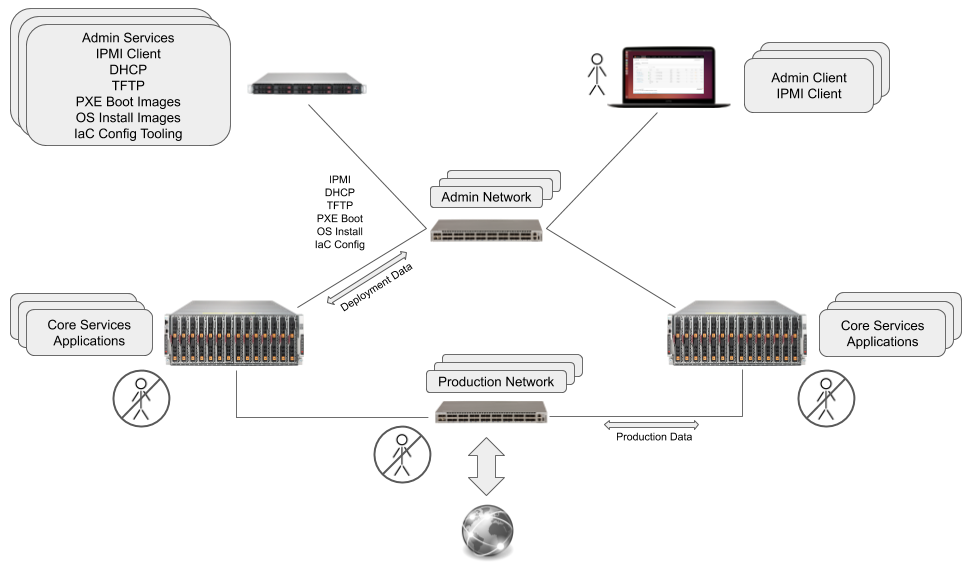
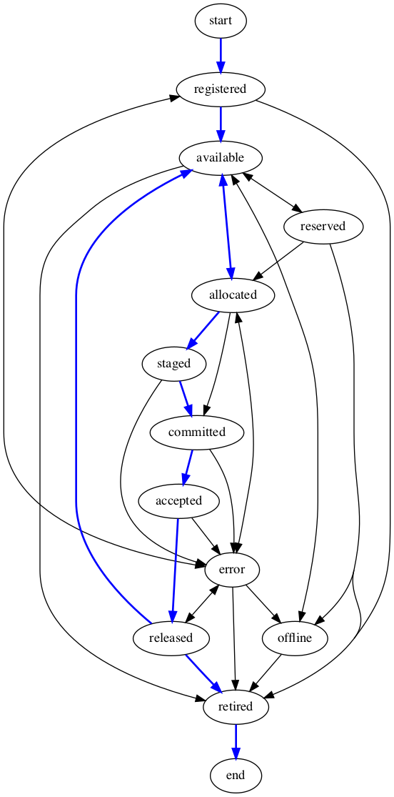

# Best Practices, Deployment and Provisioning: Overview

## Introduction

  TO BE COMPLETED (last writing step)

  * Put a definition on the term "deployment"
  * Encompass: identification, allocation, configuration for production, and eventual retirement of resource.
  * Summarise use cases: servers, network switches, video switches, video production equipment, etc.
  * Identify significance of IaC integration.
    
## Resource Deployment State Model

Resource deployment is represented using a simple life-cycle state model. Transition between states represent the progression of deployment tasks: identification, configuration, allocation, production deployment, and eventual retirment of the resource.

 *Resource deployment conceptual state model.*

| State | Description |
|---|---|
|registered | Resource existance and identify is recorded. |
|available | Resource is ready for allocation to production. |
|allocated| Resource is assigned to production and is scheduled to be configured. |
|deployed| Resource is configured and in production. |
|released| Resource is no longer active in production. |
|retired | Resource is ready to be removed from facility. |

## Generic Resource Deployment

Deployment processing can be thought of as simply finite state machine where deployment tasks are completed by the transitions from one state to the next. Succesful execution of a transition moves the resource to the next life cycle state. The following diagram identifies typical tasks that are completed during transitions in order to move a resource through its deployment life cycle.

 *Gerneric resource deployment with described state transitions.*

## Automated Resource Configuration

* Prefer Infrastructure as Code (IaC) methodologies for system configuration.
* Prefer REST API's as resource interface.
* Prefer SSH for command line access to servers.

Automated resource configuration is possible by implementation of admininistration sytsems that manage resource state and that automate the execution of processing tasks that represent the transitions between states. This requires that individual resources support automated methods of configuration. 

  Automated server configuration is possible by employing Infrastructure as Code (IaC) methodologies. Mature implementations include [Puppet](https://puppet.com/) and [Ansible](https://www.ansible.com/). Employing IaC methods to configure simpler devices, such as network or video switches, requires that those devices support some form of configuration API. IaC methods can adapt to most types of API's howerver the prefered API is a REST API. The next best is a method of command line configuration via SSH. The least prefered, and strongly discouraged, method of configuration is any manual method, and any method that requires physical access to the device.

## Security

### Adhere to AMWA BCP-003

 * OAuth2 secury user authorization
 * TLS 1.2 for secure socket communication
 * X.509 certificate installation support
 * HTTPS exclusively for REST API's
 * REST API's use Authorization headers and Json Web Tokens

These recomendations conform to [AMWA BCP-003](https://amwa-tv.github.io/nmos-api-security/) "Security recommendations for NMOS APIs". BCP-003. AMWA BCP-003 describes best practies for implementing secure web intefaces using HTTPS and OAuth2 user authentication.

### Additional recommendations beyond AMWA BCP-003

 * SSH access secured by OAuth2 user authorization
 * SSH access secured by SSH-authorized keys
 * X.509 certificate support for SSH-key authorization
 
IaC tooling normal requires SSH access to the systems under configuration. SSH user authorization should use OAuth2. SSH authorized keys are preferred, and normally necessary, for automated SSH login. Systems that support SSH login should provide methods for installing public keys to enable SSH authorization. Note that some, but not all, SSH implementations support X.509 certificates. This provides system administors the opportunity for uniform key management and sharing of keys used for HTTPS configuration.
    
__*TODO - Traditional SSH authorized_key sharing has security problems. Study SSH certificates including X.509 support.*__

__*TODO - Consider update of BCP-0003 to include service account recommendations.*__

### Service Accounts

 * Use of service accounts for server-to-server interaction

Automated server to server interactions in trusted environments that are not perforrmed on behalf of an end user should use service accounts. A service account is an account that belongs to an application instead of an individual end user. 

Service account authorization is supported using OAuth2 "two legged" authentication. See: [OAuth 2.0 Client Credentials Grant](https://oauth.net/2/grant-types/client-credentials/)

## Resource Deployment State Model - Metal-as-a-Service Example

Metal-as-a-Service (MaaS) refers to the automated povisioning of data-center compute resources. This is often described as "cloud style provisioning". 

MaaS encompases automation of the following:

* server identification
* firmware configuration
* allocation management
* operating system installation
* application sofware installation and configuration
* network configuration
* decommisionning

### Example Existing Industry Solutions:

* [Ubuntu MaaS](https://maas.io/) is an example of an existing commercial implementation.
* [GitHub metal cloud](https://github.blog/2015-12-01-githubs-metal-cloud/) is an example of proprietary implementation.

### Implementations Leverage Mature Standards and Tooling

Metal-as-a-service (MaaS) implementation patterns leverage very mature industry standards to automate system mangement and monitoring, network boot, IP address management. MaaS system leverage these standards by adding automation tooling and administration systems that support managing many system reliably and efficiently at production scale.

| Standards | |
|---|---|
|DHCP| Automated IP address assignment. |
|TFTP| File transfer protocol used for network booting. |
|PXE| Network boot capability built on DHCP and TFTP. Built into system firmware. |
|IPMI| Out-of-band system management and monitoring independent of the host CPU and OS. Independent network interface, controller, and firmware. |

Note that IPMI is a deprecated standard and that new system management standards such as [Redfish](https://redfish.dmtf.org/) fullfil an equivalent purpose.

### Metal-as-a-Service representend using the resource model

The following diagrams maps typical MaaS server configuration operations onto the resource model. The operations described in each transation can be entirly automated with the exception of administrator input to allocate, and retire, server resources.

*Resource deployment metal-as-a-service example.*

### Separate Admin and Production Networks

MaaS systems exploit server's system manage controls to configure, monitor, and control servers. These interfaces are typcally confiugred on a dedicated amdministrator network that is separate from production networks. In addition network interfaces are configured for admin network PXE boot, automated OS install, and IaC application configuration. Configuring server's production network interfaces is the responsiblity of IaC processing and falls under application configuration. A fully automated deploy system experiences no manual human configuration of production servers, server network interfaces, or production network switches. In a media environment this automated configuration may included video switch configuration.

*Independent admin and production network.*

## Resource Deployment State Model - Network Swith Port Example

Incorrporation of network configuration in IaC deployment methodologies is becoming possible. See, for example, [CBC's implementation of IaC configuration of Embrionix emsfp EB22 modules using Ansilbe playbooks](https://github.com/cbcrc/ansible-embrionix). The opens the possiblity of treating network switches, and individual network ports, as resources that can be managed as part of production deployment and provisioning system. A resource model instantiation that might implement this is shown below.

*Resource deployment network switch port example.*

## Appendix - Resource State Model: Example fuller representation

A real-world implementation of a resource life-cycle model is necessarily more complex than the conceptual model presented here. Additional complexities may include:

* Additional states are required to implement requirements suchs as reservation of resources, or putting resources offline for maintenance.
* The requirement for a fuller set of transitions between states that is represented by a simple conception model.
  * e.g. to return to "available" from "allocated" without ever having been deployed.
  * e.g. retiring a registered resource before ever having made it available
* The real-world requirement for robust exception handling that introduces error states.

The finite-state-machine model below represent these additional complexities.

 
*Example fuller representation of resource state model finite state machine.*

| Current State | Transition | Next State |
|---|---|---|
|start| T_new_register |registered|
|registered| T_make_new_available |available|
|registered| T_retire |retired|
|registered| T_from_reg_error |error|
|available| T_allocate |allocated|
|available| T_retire |retired|
|available| T_put_offline |offline|
|available| T_reserve |reserved|
|reserved| T_make_existing_available |available|
|reserved| T_allocate |allocated|
|reserved| T_retire |retired|
|reserved| T_put_offline |offline|
|offline| T_make_existing_available |available|
|offline| T_retire |retired|
|allocated| T_deploy |deployed|
|allocated| T_make_existing_available |available|
|allocated| T_from_alloc_error |error|
|deployed| T_release |released|
|released| T_make_existing_available |available|
|released| T_retire |retired|
|released| T_from_release_error |error|
|error| T_error_recover | registered |
|error| T_error_recover | allocated |
|error| T_error_recover | released |
|error| T_error_recover | offline |
|error| T_retire | retired |
|retired| T_end_of_life |end|

*Example state transition table.*
  

| Transition | Activity or Processing |
|---|---|
|T_new_register | Register the identity of a new resource. |
|T_make_new_available | Perform processing to make a new resource available. |
|T_make_existing_available | Perorm processing to return an existing resource to available. |
|T_allocate | Allocate a resource for production deployment. |
|T_deploy | Perform processing to configure a resource for production. |
|T_put_offline | Perform processing to put an existing resource offline. |
|T_release | Perform processing to release a deployed resource. |
|T_reserve | Move a resource into reserved state. |
|T_retire | Perform processing to decommission a resource. |
|T_from_alloc_error | Notify admin, error transitioning out of allocated state. |
|T_from_reg_error | Notify admin, error transitioning out of registered state. |
|T_from_release_error | Notify admin, error transitioning out of released state. |
|T_error_recover | Return to pre-error state, retry last event. |
|T_end_of_life | Perform resource end life tasks, e.g. remove resource form facilities. |

*Example transition descriptions.*
